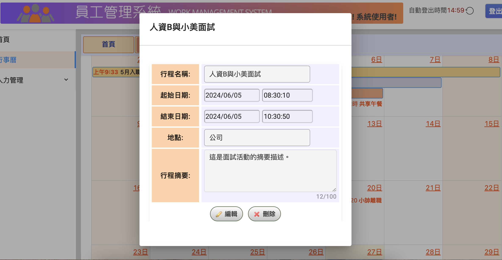

# **員工管理系統前端畫面** *****`Employee Management System Demo`*****

  - [\[專案介紹 ── Description\]](#專案介紹--description)
    - [\[前端敘述 ── Frontend Description\]](#前端敘述--frontend-description)
  - [\[畫面展示 ── Demo\]](#功能流程--functional-flow)
  
## [專案介紹 ── Description]
此專案為員工管理系統前端程式。

>前端框架（framework）：Angular

>前端語言（frontend language）：TypeScript

### [前端敘述 ── Frontend Description] 

該專案是使用 [Angular CLI](https://github.com/angular/angular-cli) 版本 17.3.8 產生的。

#### 開發伺服器

為開發伺服器運行“ng serve”。導航至“http://localhost:4200/”。如果您更改任何來源文件，應用程式將自動重新載入。

#### 程式碼腳手架

執行“ng generate組件組件名稱”來產生一個新組件。您也可以使用“nggeneratedirective|pipe|service|class|guard|interface|enum|module”。

#### 建造

運行“ng build”來建置專案。建置工件將儲存在“dist/”目錄中。

#### 運行單元測試

執行 `ng test` 透過 [Karma](https://karma-runner.github.io) 執行單元測試。

#### 運行端對端測試

執行“ng e2e”透過您選擇的平台執行端對端測試。要使用該命令，您需要先新增一個實現端到端測試功能的套件。

#### 進一步幫助

要獲得更多關於 Angular CLI 的協助，請使用「ng help」或查看 [Angular CLI 概述和命令參考](https://angular.io/cli) 頁面。

## [畫面展示 ── Demo]

>### [首頁畫面]
>

>### [行事曆畫面]
>

>### [員工資料管理畫面]
>

>### [查詢結果畫面]
>

>### [行事曆事件燈箱畫面]
>
